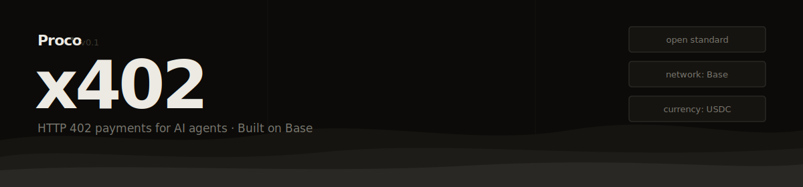

<p align="center">
  
</p>

<p align="center">
  <a href="https://www.npmjs.com/package/@proco/pay"></a>
  
  
  
  <a href="https://github.com/coinbase/x402"></a>
</p>

---

Payment infrastructure for AI agents. Agent wallets, policy-enforced spending, and settlement on Base — built on the open x402 standard.

## What is Proco pay?

Proco pay is the financial layer that sits between your AI agents and any paid API. Agents get their own wallets, spend within policies you define, and pay automatically using the x402 protocol — no human in the loop.

```
Agent  ->  GET /data
Server  <-  402 + { amount: $0.01, network: "base", currency: "USDC" }
Agent  ->  GET /data + X-Payment: <signed proof>
Server  <-  200 + data
```

## What it handles

- **Agent wallets** — each agent holds its own USDC balance, independent of human accounts
- **Policy enforcement** — per-agent spending caps, vendor allowlists, and time-based rules before every transaction
- **Payment verification** — validates signed payment proofs before resources are unlocked
- **Settlement** — submits USDC payments to Base on behalf of agents
- **Audit train** — every payment logged with agent ID, vendor, amount, and settlement hash

## Installation

```bash
npm install @proco/pay
```

## Protect a resource

One middleware line. Proco handles everything else.

```typescript
import express from 'express'
import { procoX402Middleware } from '@proco/pay/express'

const app = express()

app.use(procoX402Middleware({
  apiKey: process.env.PROCO_API_KEY,
  routes: {
    'GET /data':     { amount: 1_00, currency: 'USDC', description: 'Market data' },
    'POST /analyze': { amount: 5_00, currency: 'USDC', description: 'AI analysis' },
  }
}))

app.get('/data', (req, res) => {
  res.json({ price: 42.00 })
})
```

## Pay with one function call

```typescript
import { Proco } from '@proco/sdk'

const proco = new Proco({ apiKey: process.env.PROCO_API_KEY })

const wallet = await proco.wallets.create({
  agentId: 'research-agent-01',
  policies: {
    dailyCap: 50_00,
    vendors: ['api.example.com'],
    currency: 'USDC'
  }
})

// proco.fetch() intercepts 402s, pays, and returns the 200 automatically
const res = await proco.fetch('https://api.example.com/data', { wallet: wallet.id })
const data = await res.json()
```

## Payment policies

```typescript
const wallet = await proco.wallets.create({
  agentId: 'budget-agent',
  policies: {
    dailyCap: 100_00,         // $100/day
    perTx: 10_00,             // $10 max per transaction
    vendors: [                 // vendor allowlist
      'api.perplexity.ai',
      'serper.dev',
      'api.openai.com'
    ],
    hoursActive: [9, 17],     // only transact 9am-5pm UTC
    currency: 'USDC'
  }
})
```

Policy violations throw before any on-chain transaction occurs:

```typescript
import { PolicyViolationError } from '@proco/pay'

try {
  await proco.fetch('https://expensive-vendor.com/api', { wallet: wallet.id })
} catch (e) {
  if (e instanceof PolicyViolationError) {
    console.log(e.reason) // -> "vendor not in allowlist"
  }
}
```

## Environments

| Environment | Network | Currency | API |
|-------------|---------|----------|-----|
| sandbox | Base Sepolia testnet | Testnet USDC | `sandbox.api.procohq.com` |
| production | Base mainnet | USDC | `api.procohq.com` |

Sandbox keys are free. No credit card. Start at [procohq.com/sandbox](https://procohq.com/sandbox).

## x402 compatibility

Proco pay is fully compatible with the [coinbase/x402](https://github.com/coinbase/x402) open standard. Any resource server using `@x402/express`, `@x402/hono`, `@x402/next`, or any x402 middleware will work with Proco as the client-side facilitator.

Supported: `exact` scheme on EVM (Base, Ethereum) · USDC on Base · Standard `PAYMENT-REQUIRED` and `PAYMENT-SIGNATURE` headers · `/verify` and `/settle` endpoints.

## Self-hosting

```bash
git clone https://github.com/procohq/pay
cd pay && npm install
cp .env.example .env
npm run start
```

## Related

- [`procohq/lab`](https://github.com/procohq/lab) — free developer environment for testing agent payments
- [`coinbase/x402`](https://github.com/coinbase/x402) — the x402 open standard
- [procohq.com](https://procohq.com) — production API and wallet dashboard

## Contributing

PRs welcome for additional EVM network support, fiat payment schemes, and new framework middleware. See `CONTRIBUTING.md`.

---

<p align="center">
  <a href="https://procohq.com">procohq.com</a> &middot; MIT &middot; Built by Proco
</p>
